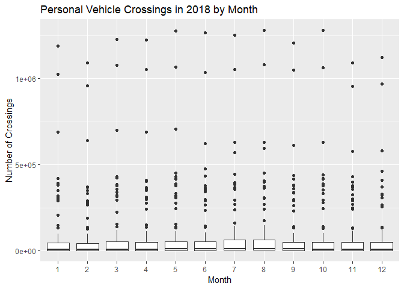
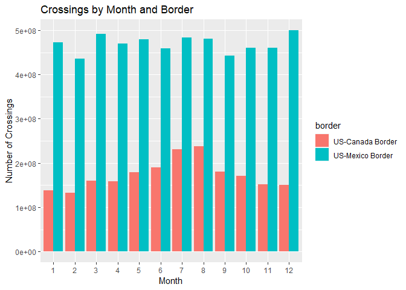
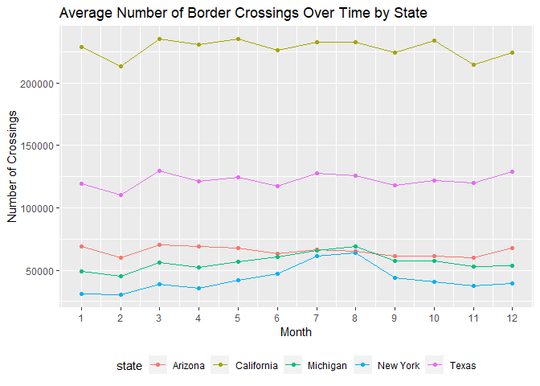
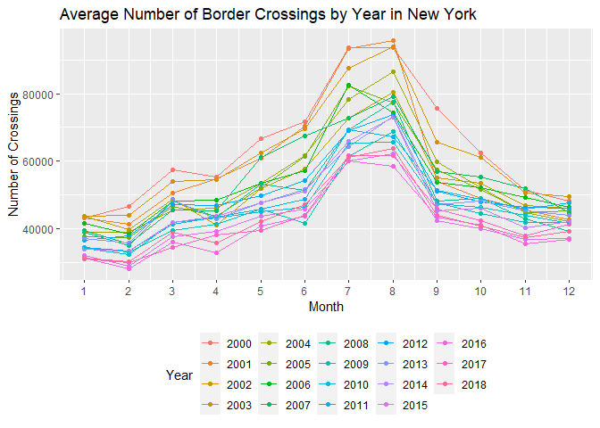

Code for final project
================
11/5/2020

## Reading in a tidying the data

Reading in the border crossing data:

  - Time information was removed since all times were 12am and thus were
    not useful
  - All day information was removed because all were on the 1st of the
    month for each month
  - Years before 2000 were removed
  - There is an Eastport (`port_name`) in Maine and Idaho. Create a
    port\_name\_state variable instead so there is no confusion
  - Kept state variable but removed port\_name– we might want to look at
    state alone
  - I removed 2019 because there is only data for Jan, Feb and March
  - A lot of values were equal to 0. I removed these rows since that
    means there were no border crossings at that time for those measure
    types.

<!-- end list -->

``` r
border_crossing_df = read_csv(file = "./Border_Crossing_Entry_Data.csv") %>% 
  janitor::clean_names() %>% 
  mutate(date = str_sub(date, end = -13), 
         location = str_replace(location, "POINT ", ""), 
         port_name_state = str_c(port_name, state, sep = "_")) %>% 
  separate(date, into = c("month", "day", "year"), sep = "/", convert = TRUE) %>% 
  select(-day, -port_name) %>% 
  separate(location, into = c("long", "lat"), sep = " ") %>% 
  mutate(long = str_replace(long, "\\(", ""), 
         lat = str_replace(lat, "\\)", ""), 
         long = as.numeric(long),
         lat =  as.numeric(lat)) %>% 
  filter(year >= 2000, year < 2019, value != 0)
```

    ## Parsed with column specification:
    ## cols(
    ##   `Port Name` = col_character(),
    ##   State = col_character(),
    ##   `Port Code` = col_double(),
    ##   Border = col_character(),
    ##   Date = col_character(),
    ##   Measure = col_character(),
    ##   Value = col_double(),
    ##   Location = col_character()
    ## )

Findings from tables below:

  - Most border crossings in July/August. Summer vacations?
  - Decline in border crossings since 2000. Largest drop off after 2008.
    Obama admin?
  - Ohio has very few border crossings and only in 2018 (Toldeo-Sandusky
    Port 4105). ICE issues?
  - A lot more crossings for US-Mexico border than US-Canada border

<!-- end list -->

``` r
## Border crossings by month 
border_crossing_df %>% 
  group_by(month) %>% 
  summarize(n = sum(value))
```

    ## `summarise()` ungrouping output (override with `.groups` argument)

    ## # A tibble: 12 x 2
    ##    month         n
    ##    <int>     <dbl>
    ##  1     1 611107875
    ##  2     2 568690871
    ##  3     3 651409308
    ##  4     4 628266842
    ##  5     5 658004778
    ##  6     6 648545701
    ##  7     7 714405951
    ##  8     8 718551827
    ##  9     9 623220080
    ## 10    10 631347754
    ## 11    11 612730589
    ## 12    12 649952890

``` r
## Border crossings by year
border_crossing_df %>% 
  group_by(year) %>% 
  summarize(n = sum(value))
```

    ## `summarise()` ungrouping output (override with `.groups` argument)

    ## # A tibble: 19 x 2
    ##     year         n
    ##    <int>     <dbl>
    ##  1  2000 540021542
    ##  2  2001 493083902
    ##  3  2002 475702818
    ##  4  2003 456392653
    ##  5  2004 458220298
    ##  6  2005 450234268
    ##  7  2006 440296022
    ##  8  2007 417587175
    ##  9  2008 399902033
    ## 10  2009 359451762
    ## 11  2010 344246536
    ## 12  2011 332226000
    ## 13  2012 344503916
    ## 14  2013 356218438
    ## 15  2014 363314116
    ## 16  2015 365219998
    ## 17  2016 367484183
    ## 18  2017 372971276
    ## 19  2018 379157530

``` r
## Border crossings by state
border_crossing_df %>% 
  group_by(state) %>% 
  summarize(n = sum(value))
```

    ## `summarise()` ungrouping output (override with `.groups` argument)

    ## # A tibble: 15 x 2
    ##    state                 n
    ##    <chr>             <dbl>
    ##  1 Alaska         11573060
    ##  2 Arizona       715509023
    ##  3 California   2056017209
    ##  4 Idaho          17215550
    ##  5 Maine         174217600
    ##  6 Michigan      557354352
    ##  7 Minnesota      77081223
    ##  8 Montana        43232599
    ##  9 New Mexico     58338762
    ## 10 New York      653477192
    ## 11 North Dakota   63229290
    ## 12 Ohio                373
    ## 13 Texas        2804141437
    ## 14 Vermont        91600402
    ## 15 Washington    393246394

``` r
## Border crossings by measure
border_crossing_df %>% 
  group_by(measure) %>% 
  summarize(n = sum(value))
```

    ## `summarise()` ungrouping output (override with `.groups` argument)

    ## # A tibble: 12 x 2
    ##    measure                              n
    ##    <chr>                            <dbl>
    ##  1 Bus Passengers               113548058
    ##  2 Buses                          6904908
    ##  3 Pedestrians                  859594269
    ##  4 Personal Vehicle Passengers 4189113375
    ##  5 Personal Vehicles           2068077007
    ##  6 Rail Containers Empty         19082028
    ##  7 Rail Containers Full          34186220
    ##  8 Train Passengers               5149980
    ##  9 Trains                          735791
    ## 10 Truck Containers Empty        54526962
    ## 11 Truck Containers Full        154262783
    ## 12 Trucks                       211053085

``` r
## Border crossings by port
border_crossing_df %>% 
  group_by(port_name_state) %>% 
  summarize(n = sum(value)) %>% 
  arrange(desc(n))
```

    ## `summarise()` ungrouping output (override with `.groups` argument)

    ## # A tibble: 117 x 2
    ##    port_name_state                        n
    ##    <chr>                              <dbl>
    ##  1 San Ysidro_California          961771552
    ##  2 El Paso_Texas                  879953412
    ##  3 Laredo_Texas                   514981282
    ##  4 Buffalo-Niagara Falls_New York 426670702
    ##  5 Hidalgo_Texas                  421612662
    ##  6 Brownsville_Texas              403087196
    ##  7 Otay Mesa_California           383875040
    ##  8 Calexico_California            380156649
    ##  9 Detroit_Michigan               353224718
    ## 10 Nogales_Arizona                323086640
    ## # ... with 107 more rows

``` r
## Border crossings by border 
border_crossing_df %>% 
  group_by(border) %>% 
  summarize(n = sum(value))
```

    ## `summarise()` ungrouping output (override with `.groups` argument)

    ## # A tibble: 2 x 2
    ##   border                    n
    ##   <chr>                 <dbl>
    ## 1 US-Canada Border 2082228035
    ## 2 US-Mexico Border 5634006431

Potential Visuals:

  - I think we can make some of these interactive in the shiny app. For
    example, we can set year as an input option for the drop down menu
    or measure type or state

<!-- end list -->

``` r
## Boxplot

#Just look at 2018 and personal vehicles for example here

border_crossing_df %>%
  filter(year == 2018, measure == "Personal Vehicles") %>%
  group_by(month) %>% 
  ggplot(aes(x = as.factor(month), y = value)) + 
  geom_boxplot() + 
  labs(title = "Personal Vehicle Crossings in 2018 by Month",
       x = "Month", 
       y = "Number of Crossings")
```

<!-- -->

``` r
## Bar plot

border_crossing_df %>%
  group_by(month, border) %>% 
  summarize(n = sum(value)) %>% 
  ggplot(aes(x = as.factor(month), y = n, fill = border)) + 
  geom_bar(stat = "identity", position = 'dodge') + 
  labs(title = "Crossings by Month and Border",
       x = "Month", 
       y = "Number of Crossings")
```

    ## `summarise()` regrouping output by 'month' (override with `.groups` argument)

<!-- -->

``` r
## Average values over time for top 3 states in 2018
border_crossing_df %>%
  filter(state %in% c("Texas", "California", "Arizona", "New York", "Michigan"), year == 2018) %>% 
  group_by(state, month, year) %>%  
  summarize(mean_value = mean(value)) %>%
  ggplot(aes(x = month , y = mean_value, color = state)) + 
  geom_point() + 
  geom_line() + 
  theme(legend.position = "bottom") + 
  scale_x_continuous(limits = c(1,12), breaks = c(1:12)) +
  labs(title = "Average Number of Border Crossings Over Time by State",
       x = "Month", 
       y = "Number of Crossings")
```

    ## `summarise()` regrouping output by 'state', 'month' (override with `.groups` argument)

<!-- -->

``` r
## For this one, we can have a drop down option for state. will show just for New York now
border_crossing_df %>%
  filter(state == "New York") %>% 
  group_by(month, year) %>%  
  summarize(mean_value = mean(value)) %>%
  ggplot(aes(x = month , y = mean_value, color = as.factor(year))) + 
  geom_point() + 
  geom_line() + 
  theme(legend.position = "bottom") + 
  scale_x_continuous(limits = c(1,12), breaks = c(1:12)) +
  labs(title = "Average Number of Border Crossings by Year in New York",
       x = "Month", 
       y = "Number of Crossings", 
       color = "Year")
```

    ## `summarise()` regrouping output by 'month' (override with `.groups` argument)

<!-- -->
