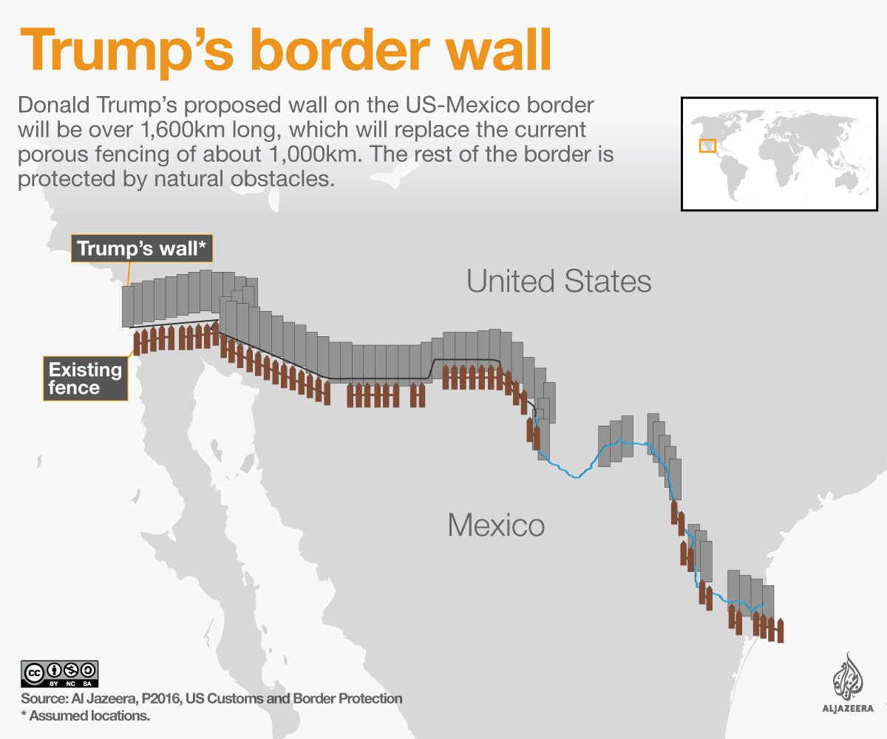

 
 

    "Cross border movements of goods and people are vital to the economies of the
Border States and Provinces, as well as to the two national economies (Eastern Border Transportation Coalition)"

 

  

 

        

   Immigration has been a hotly contested issue during Trump’s presidency. Marking his words of building a “big, beautiful wall” in 2016, President Donald Trump got the green light from The Supreme Court in 2019 and $2.5 billion from the Pentagon’s budget to building up the U.S.-Mexico border. 

    

## Motivation:

Immigration has been a hotly contested issue during Trump’s presidency. Marking his words of building a “big, beautiful wall” in 2016, President Donald Trump got the green light from The Supreme Court in 2019 and $2.5 billion from the Pentagon’s budget to building up the U.S.-Mexico border.

Although the data we found on border crossings on Kaggle are recorded, legal, and do not run into 2020, we were interested in looking at border crossing trends because of this issue. We are hypothesizing that the illegal immigration policy under Trump administration affects to ‘legal’ border crossing as unfavorable tension between the US and Mexico may shrink non-imminent  border crossing activity. Understanding the change in legal border crossing is crucial when considering the United States and Mexico’s mutually dependent relationship in many aspects: including economy, separated immigrants’ family issues, etc. Indeed, Mexico has remained the United States’ second-largest export market since 1995, with exports totaling $242 billion in 2017.This analysis will help us understand and show how the border crossings play into life (e.g. movement of goods, commuting, holiday travel).

## Basic Information

In this project, we will compare the US-Mexico border crossing since 2020 
 
In the Exploratory Analyses tab, you can observe  
* change in the number of border crossing across years  
* seasonal trend  
* difference between each vehicle type. 

In the Shinyapp tab, we provide two interactive maps  
* Chart A: Map show the border crossing number based on customized forBorder choice, Year, State setting  
* Chart B: XXXX

Our final project report can be found here. A brief screencast of our project can be found here.

 